# 📚 Student Services Portal  


A **web-based student portal** designed for **Ewing Christian College, Prayagraj (ECC)** to streamline student services such as login, fees payment, complaints, feedback, notices, downloads, and more.  

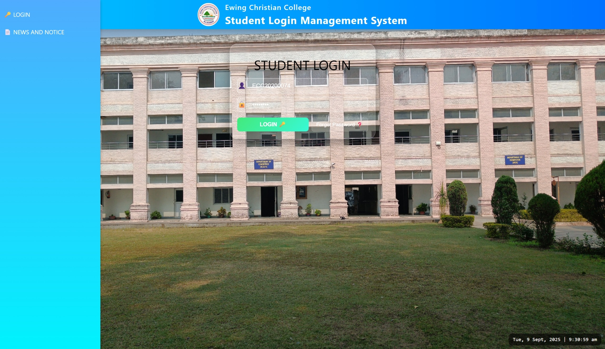  
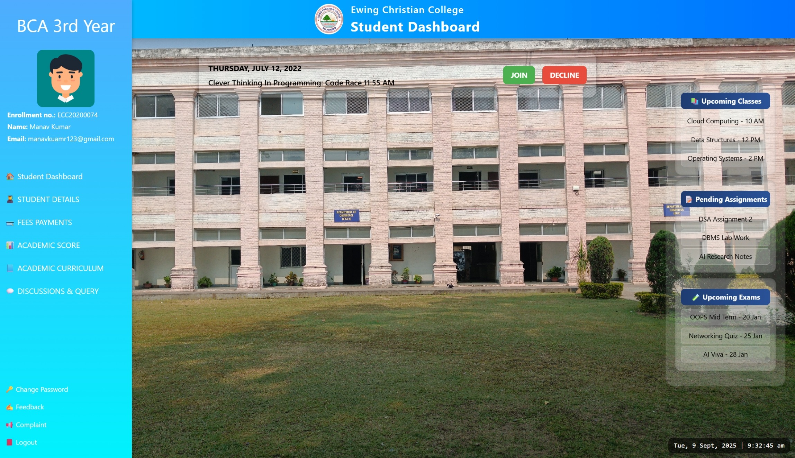  
---
## ✨ Features

* 🔑 **Login System**

  * Secure student login with enrollment number + password validation.
  * Separate dashboards for different students (Stu\_1, Stu\_2).

* 🔄 **Change Password**

  * Password validation with rules.
  * Server-side simulation with confirmation flow.

* 📝 **Student Details & Update Information**

  * Glassmorphism-styled student profile cards.
  * Editable information fields with approval process.
  * Profile photo upload support.

* 💳 **Fees Payment**

  * Student details with session-wise fee info.
  * Payment options (Full, 50%, 25%).
  * Pay button enabled dynamically after selection.

* 📢 **Complaint Box**

  * Submit complaints as an individual or batch.
  * Dynamic enabling of email/phone for individuals.
  * Confirmation modal before final submission.

* 💬 **Feedback Form**

  * Collects product/service feedback.
  * Recommendation (Yes/No) options.

* 📰 **News, Notices & Downloads**

  * Organized sections for **News, Notices, Downloads**.
  * Integrated with PDF/document links.
  * Icons for quick recognition.

* 💡 **Discussion & Query**

  * Student discussions and query placeholders.

* 🚪 **Logout**

  * Glassmorphic logout confirmation with redirect.

* ⚠️ **Error Page**

  * Custom styled error page with “Go Back” or “Go Home” options.

---

## 🖥️ Tech Stack

* **Frontend:** HTML5, CSS3 (Glassmorphism, Responsive Design)
* **JavaScript:** Vanilla JS (form validation, dynamic modals, interactivity)
* **UI Libraries:** W3.CSS for responsive layouts
* **Assets:** Custom icons, college logo, profile photos

---

## 📂 Project Structure

```
Student_Services_Portal/
│
├── CSS/                # Stylesheets
├── Js/                 # JavaScript files
├── Pictures/           # Images & icons
├── Colledge_Documents/ # PDFs for News, Notices, Downloads
│   ├── News/
│   ├── Notice/
│   └── Downloads/
├── Stu_1/              # Student 1 Dashboard + Pages
├── Stu_2/              # Student 2 Dashboard + Pages
│
├── Login.html          # Login Page
├── News,_Notices_&_Downloads.html
├── error.html
└── README.md           # Project Documentation
```

---
## 📸 Screenshots  

Here are some key pages of the project (all screenshots are stored in the `Screenshots` folder):  

- **Login Page**  
    

- **Notices Page**  
  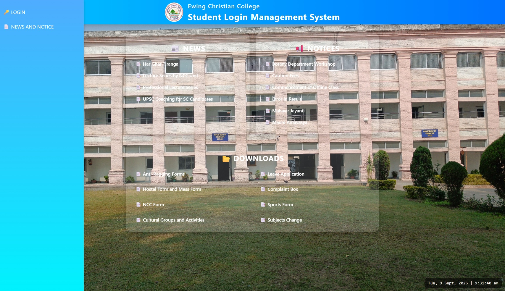  

- **Student Dashboard (Student 1)**  
    

- **Student Dashboard (Student 2)**  
  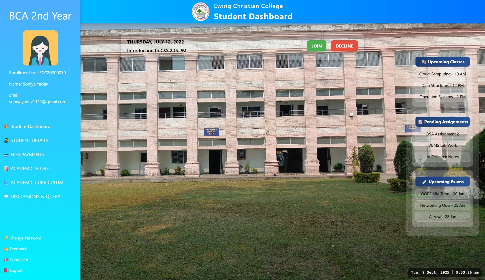  

- **Live Class**  
  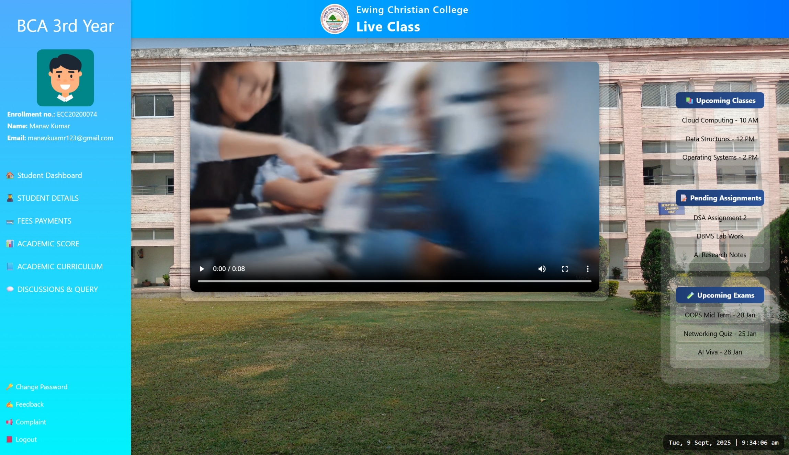  

- **Student Details**  
  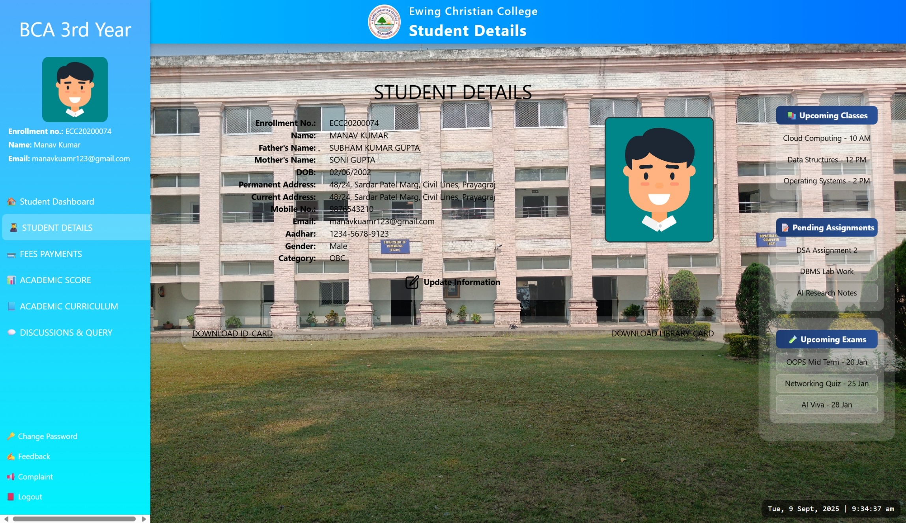  

- **Update Student Details**  
  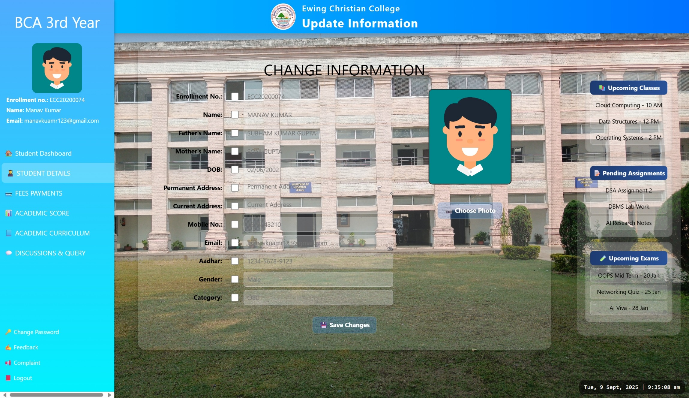  

- **Update Confirmation**  
    

- **Fee Payment**  
  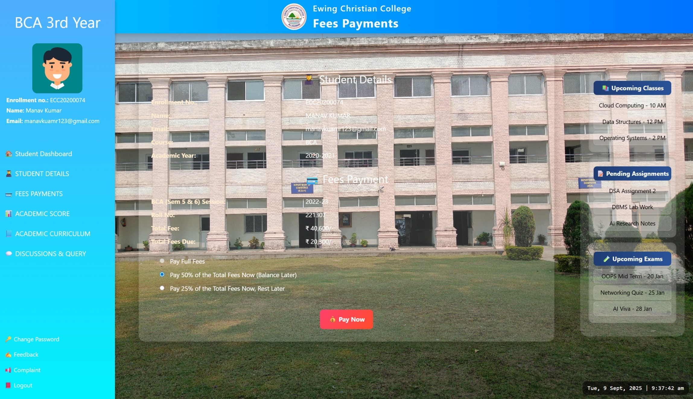  

- **Result**  
  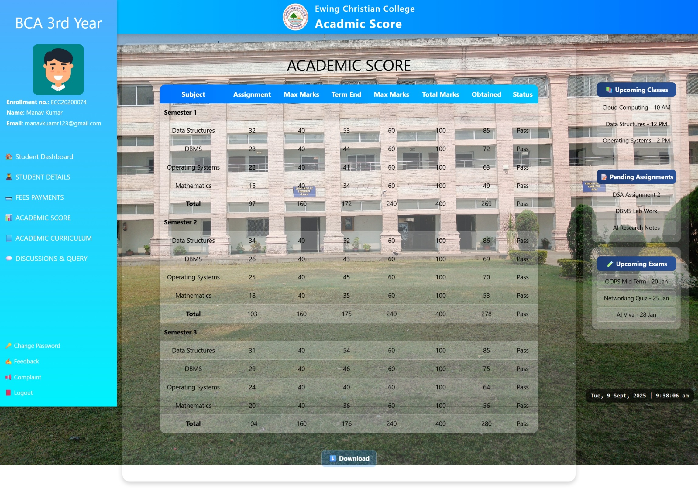  

- **Discussions & Query**  
  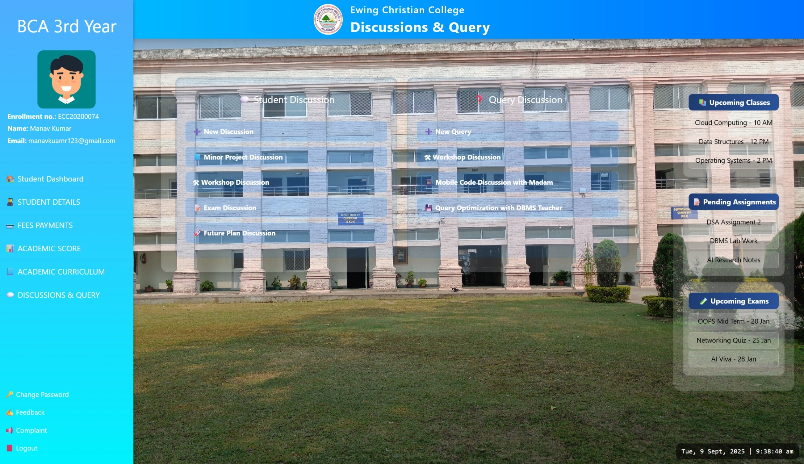  

- **Feedback**  
  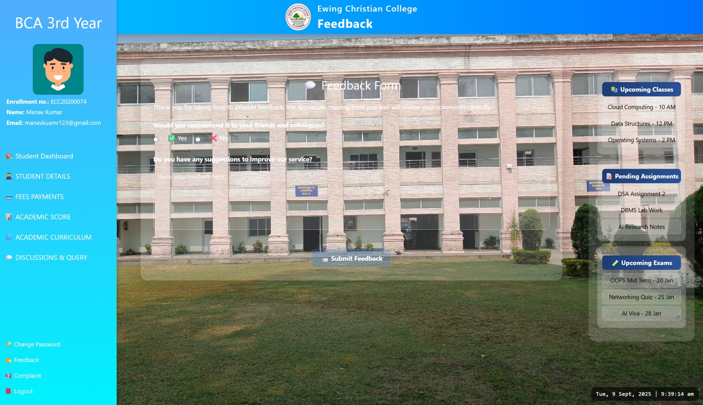  

- **Complaint Box**  
  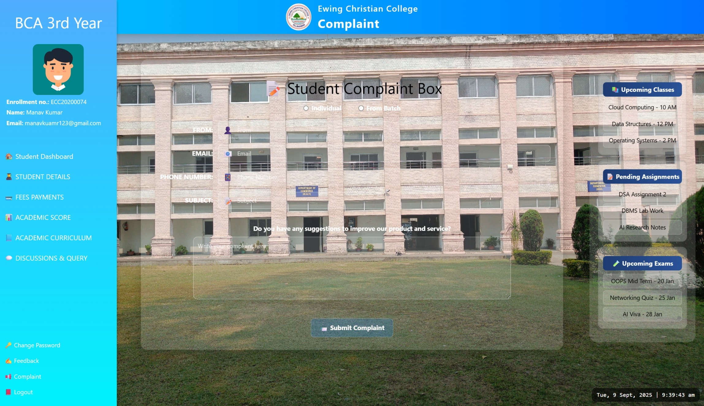  

---

## 🚀 How to Run

1. Clone the repository:

   ```bash
   git clone https://github.com/ashutoshg780/Student_Services_Portal.git
   cd Student_Services_Portal
   ```
2. Open `index.html` in your browser.
3. Use sample credentials:

   * **Stu\_1:** `ECC20200074 / 02062002`
   * **Stu\_2:** `ECC20200079 / 11112004`

---

## 📌 Future Enhancements

* Integrate with **real backend (PHP/Node.js + MySQL)** for live data.
* Add **role-based dashboards** (Admin, Teacher, Student).
* Secure **password hashing** and real-time complaint tracking.
* Mobile responsive optimization.

---

## 👨‍💻 Author  

**Ashutosh Gupta**  
🎓 BCA 2nd Year (4th Semester) Project  
🏫 Ewing Christian College (ECC), Prayagraj  
[](https://www.linkedin.com/in/ashutoshg780) 
[](https://github.com/ashutoshg780)


